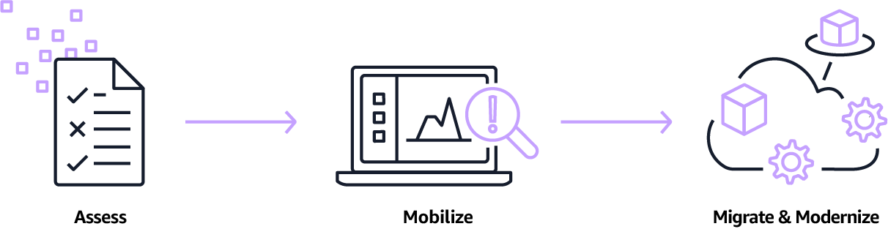

# [Getting started with AWS](https://aws.amazon.com/getting-started/)
    - [Setting up AWS Account](https://aws.amazon.com/getting-started/guides/setup-environment/?pg=gs&sec=gtkaws)
        - Create a new AWS account
		- Secure the root user
		- Create an IAM user to use in the account
		- Setup the AWS CLI
		- Setup an AWS Cloud9 environment
	- [Getting Started with the AWS Management Console](https://aws.amazon.com/getting-started/hands-on/getting-started-with-aws-management-console/?pg=gs&sec=gtkaws)
	- [Getting Started with AWS Cloud Development Kit](https://aws.amazon.com/getting-started/guides/setup-cdk/?pg=gs&sec=gtkaws)
      AWS Cloud Development Kit (CDK) is an open source software development framework that allows to define cloud application
	  resources using familiar programming languages, like JavaScript, TypeScript, Python, Java and C#. The code gets transpiled
	  into CloudFormation templates and creates infrastructure using AWS CloudFormation.
	- [Cloud Essentials](https://aws.amazon.com/getting-started/cloud-essentials/?pg=gs&refid=ff721c0f-c85d-4643-817f-04fb0e8a7323)
	    - What is cloud computing?
		- What is AWS Cloud?
		- On-premises and Cloud computing
		- IaaS, PaaS, SaaS
		- Global Infrastructure
		- Developer Tools
		- Infrastructure as Code (IaC)
		- Well-Architectured infrastructure
		- Security
    - Resource Centers
	    - [Developer Center](https://aws.amazon.com/developer/?pg=gs&sec=rc)
		- [Architecture Center](https://aws.amazon.com/architecture/?pg=gs&sec=rc)
	- Dive Deeper
	    - [Compute](https://aws.amazon.com/getting-started/hands-on/?pg=gsrc&getting-started-all.sort-by=item.additionalFields.sortOrder&getting-started-all.sort-order=asc&awsf.getting-started-category=category%23compute&awsf.getting-started-level=*all&awsf.getting-started-content-type=*all&refid=ff721c0f-c85d-4643-817f-04fb0e8a7323)
		- [Databases](https://aws.amazon.com/getting-started/deep-dive-databases/?pg=gs&sec=dd)
		- [Storage](https://aws.amazon.com/getting-started/hands-on/?pg=gsrc&getting-started-all.sort-by=item.additionalFields.sortOrder&getting-started-all.sort-order=asc&awsf.getting-started-category=category%23storage&awsf.getting-started-level=*all&awsf.getting-started-content-type=*all)
		- [Containers](https://aws.amazon.com/getting-started/deep-dive-containers/?pg=gs&sec=dd)
		- [Serverless](https://aws.amazon.com/getting-started/deep-dive-serverless/?pg=gs&sec=dd)
		- [Machine Learning](https://aws.amazon.com/getting-started/deep-dive-ml/?pg=gs&sec=dd&refid=ff721c0f-c85d-4643-817f-04fb0e8a7323)
	- [Best Practices](https://aws.amazon.com/organizations/getting-started/best-practices/)

# [The migration process](https://aws.amazon.com/cloud-migration/how-to-migrate/)

  - ## Access Phase
    Assess the organization's current readiness for operating in the cloud. Identify the desired outcomes and 
	develop the business case for migration.
	#### Services
	  - Migration Evaluator
	  - Migration Hub
	  - Prescriptive Guidance
	  
  - ## Mobilize Phase
    Address gaps in the organization's readiness with a focus of building baseline environment, driving operational readiness
    and developing cloud skills. Choose an appropriate migration strategy: relocate, rehost, replatform, refactor, repurchase,     retire or retain.
    #### Services
	  - [AWS Application Discovery Service](https://aws.amazon.com/application-discovery/)
	    Analysis of configuration, usage and behaviour data from organization's servers to help understand 
	    existing workloads and plan migration projects based on it.
	  - Migration Partner Solutions
	  - AWS Management and Goverance
	  - [AWS Landing Zone](https://aws.amazon.com/solutions/implementations/aws-landing-zone/)
	    Helps in setup of a secure, multi-account AWS environment 
	  - [AWS Control Tower](https://aws.amazon.com/controltower/)
	    Setup an automated landing zone, which is well-architected, multi-account AWS environment that can be used
		during and after migration
	  
  - ## Migrate and Modernize Phase
    Iterate on the new foundation and constantly evolve towards a modern operating model
    #### Services
        ##### Services for migrating servers, databases and applications
	        - [AWS Application Migration Service](https://aws.amazon.com/application-migration-service/)
	        - [AWS Server Migration Service](https://aws.amazon.com/server-migration-service/)
            - [AWS Database Migration Service](https://aws.amazon.com/dms/)
            - [VMware Cloud on AWS](https://aws.amazon.com/vmware/)
            - [AWS Marketplace](https://aws.amazon.com/mp/migration/)
    
        ##### Services for data transfer
            - [AWS DataSync](https://aws.amazon.com/datasync/)
            - [AWS Transfer Family](https://aws.amazon.com/aws-transfer-family/)
            - [AWS Snow Family](https://aws.amazon.com/snow/)
            - [AWS Managed Service](https://aws.amazon.com/managed-services/)
            - [AWS Service Catalog](https://aws.amazon.com/servicecatalog/)
            - [AWS Storage Gateway](https://aws.amazon.com/storagegateway/)

# [A best practice guide to setting up AWS Accounts](https://www.linkedin.com/pulse/best-practice-guide-setting-up-aws-accounts-tim-hope)

# [AWS Organizations](https://docs.aws.amazon.com/organizations/latest/userguide/orgs_introduction.html)
AWS Organizations is an account management service that enables to consolidate multiple AWS accounts into an organization
that can be created and centrally managed.
## Features
	    - Centralized management of all AWS accounts
		- Consolidated billing for all member accounts
		- Hierarchical grouping of accounts into OUs to meet budgetary, security or compliance needs
		- Policies to centralize control over the AWS Services and API actions
		- Policies to standarize tags across the resources in organization's accounts
		- Policies to control data collection and storage by AWS Services
		- Policies to configure automatic backups for the resources in the organization's accounts
		- Integration and support for AWS Identity and Access Management 
		- Integration with other AWS services
		- Global access
		- Data replication that is eventually consistent
		- Free to use
## AWS Organizations Concepts and Terminology

    
# References 
    - [Cloud migration resources](https://aws.amazon.com/cloud-migration/resources/)
	- 

